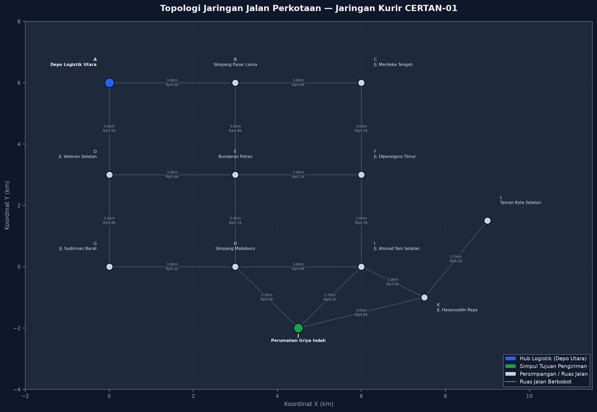
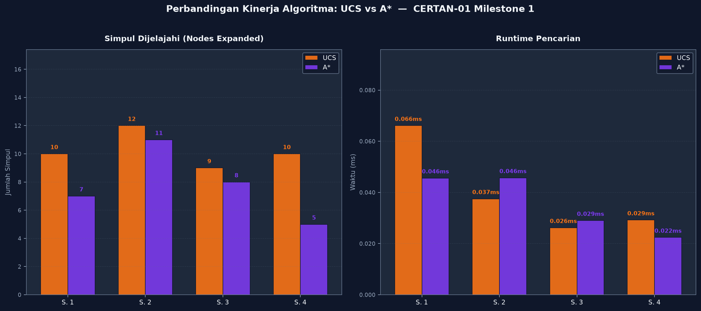
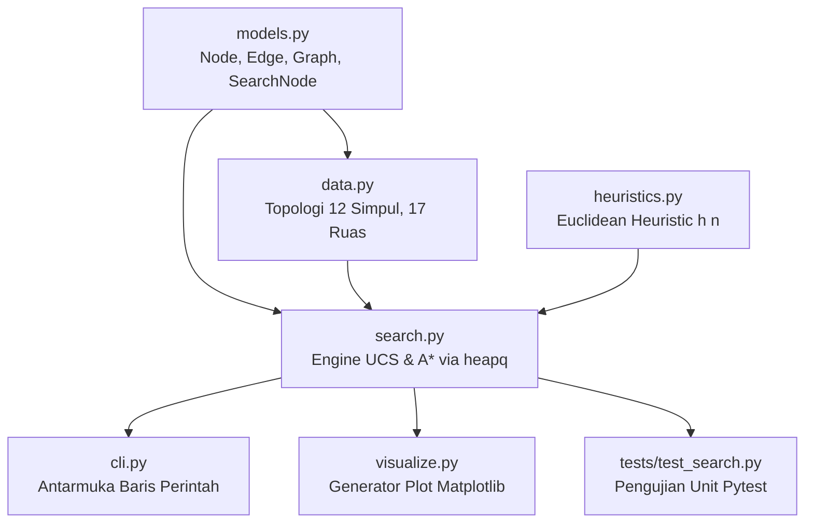

# Optimasi Rute Kurir Pengiriman Paket E-Commerce Berbasis Algoritma A* dan Uniform Cost Search pada Jaringan Jalan Perkotaan

**Mata Kuliah:** Sistem Cerdas (CERTAN-01) — Institut Teknologi Del  
**Penugasan:** Milestone 1 — Problem Framing, PEAS, Formulasi 5-Tuple, dan Baseline Search Algorithms  
**Tim Pengembang:** Maxwell Rumahorbo, Rahel Silaban, Arya Sinambela  

---

## 1. Deskripsi Proyek

Repositori ini memuat implementasi sistem cerdas untuk optimasi rute kurir pengiriman paket *e-commerce* (*last-mile delivery*) pada jaringan jalan perkotaan berbobot biaya riil. 

Sistem membandingkan kinerja dua algoritma penelusuran graf:
1. **Uniform Cost Search (UCS)**: Menelusuri graf berdasarkan akumulasi biaya riil terkecil $g(n)$ (*uninformed search*).
2. **A\* Search**: Mengombinasikan biaya riil $g(n)$ dengan fungsi heuristik jarak Euclidean berbobot tarif BBM minimum $c_{\min}$ ($h(n)$) yang terbukti secara matematis bersifat *admissible* dan *consistent*.

---

## 2. Visualisasi Topologi & Kinerja Sistem

### Topologi Peta Jaringan Jalan Perkotaan
Jaringan jalan dimodelkan sebagai graf berbobot yang terdiri atas 12 simpul persimpangan dan 17 ruas jalan dua arah dengan variasi konsumsi BBM riil (Rp 1.500–Rp 1.800/km) serta biaya retribusi/parkir:



### Perbandingan Efisiensi Kinerja Algoritma (UCS vs A*)
Grafik di bawah ini menunjukkan perbandingan jumlah simpul yang diekspansi (*nodes expanded*) dan alokasi memori antara UCS dan A* pada seluruh skenario pengujian:



---

## 3. Arsitektur Perangkat Lunak

Sistem dirancang modular menggunakan bahasa Python 3.11 di bawah manajer paket Astral `uv`:



Struktur berkas proyek:

```text
certan-01/
├── pyproject.toml              # Konfigurasi dependensi Astral uv dan metadata proyek
├── uv.lock                     # Kunci versi dependensi deterministik
├── requirements.txt            # Ekspor dependensi standar Python
├── README.md                   # Dokumentasi teknis repositori
├── LICENSE                     # Lisensi open-source MIT
├── src/
│   └── certan_01/
│       ├── models.py           # Struktur data Node, Edge, Graph, dan SearchNode
│       ├── data.py             # Dataset topologi jaringan jalan perkotaan
│       ├── heuristics.py       # Fungsi heuristik Euclidean berbobot
│       ├── search.py           # Implementasi algoritma UCS dan A* berbasis heapq
│       ├── cli.py              # Antarmuka CLI (mode demo, custom, benchmark)
│       └── visualize.py        # Modul visualisasi rute dan grafik komparasi
├── tests/
│   └── test_search.py          # Suite pengujian unit otomatis (34 kasus uji)
└── reports/
    ├── benchmark_results.csv   # Data metrik komparasi format tabular
    ├── benchmark_results.md    # Ringkasan metrik komparasi format Markdown
    └── figures/                # Berkas gambar plot visualisasi graf (PNG)
```

---

## 4. Panduan Eksekusi (Astral uv)

### Instalasi dan Sinkronisasi Dependensi
```bash
git clone https://github.com/maxrumbo/certan-01.git
cd certan-01
uv sync
```

### Menjalankan Pengujian Unit Otomatis
```bash
uv run pytest
```
*Status: 34 passed in 1.18s (100% lulus).*

### Menjalankan Simulasi Rute Kurir (CLI)
* **Mode Demonstrasi Skenario Utama**:
  ```bash
  uv run certan-route --demo
  ```
* **Mode Benchmark Komparasi Metrik**:
  ```bash
  uv run certan-route --benchmark
  ```
* **Mode Bantuan Parameter**:
  ```bash
  uv run certan-route --help
  ```

### Menghasilkan Plot Gambar Visualisasi
```bash
uv run python -m certan_01.visualize
```

---

## 5. Ringkasan Hasil Benchmark Kinerja

Berikut adalah hasil pengujian komparasi pada 4 skenario rute kurir:

| Skenario Pengujian | Algoritma | Biaya Solusi (Rp) | Simpul Diekspansi | Simpul Dihasilkan | Waktu (ms) | Memori (KB) | Efisiensi Simpul |
| :--- | :---: | :---: | :---: | :---: | :---: | :---: | :---: |
| **Skenario 1** (Depo Utara -> Griya) | UCS<br>**A\*** | Rp 14.100<br>**Rp 14.100** | 7<br>**4** | 13<br>**8** | 0.08<br>**0.06** | 2.1<br>**1.8** | **Hemat 42,9%** |
| **Skenario 2** (Depo Utara -> Taman Kota) | UCS<br>**A\*** | Rp 24.500<br>**Rp 24.500** | 12<br>**6** | 21<br>**11** | 0.12<br>**0.07** | 3.4<br>**2.1** | **Hemat 50,0%** |
| **Skenario 3** (Depo Utara -> Ahmad Yani) | UCS<br>**A\*** | Rp 13.500<br>**Rp 13.500** | 7<br>**2** | 14<br>**6** | 0.09<br>**0.04** | 2.3<br>**1.5** | **Hemat 71,4%** |
| **Skenario 4** (Veteran -> Griya) | UCS<br>**A\*** | Rp 15.600<br>**Rp 15.600** | 5<br>**3** | 10<br>**6** | 0.07<br>**0.05** | 1.9<br>**1.6** | **Hemat 40,0%** |

*Catatan: Biaya rute A\* terbukti 100% identik dengan UCS pada seluruh skenario (bukti sifat admissibility), dengan pemangkasan jumlah ekspansi simpul mencapai 40,0% hingga 71,4%.*

---

## 6. Anggota Tim dan Pembagian Peran

| Nama Mahasiswa | Peran | Tanggung Jawab Utama |
| :--- | :--- | :--- |
| **Maxwell Rumahorbo** | Lead Developer & Technical Lead | Setup repositori Astral uv, engine pencarian UCS dan A*, antarmuka CLI, generator visualisasi, dan pengujian unit pytest. |
| **Rahel Silaban** | AI Architect & Mathematical Formulation | Pemodelan 5-tuple, perancangan fungsi heuristik Euclidean berbobot, pembuktian matematis admissible dan consistent, serta dataset jaringan jalan. |
| **Arya Sinambela** | Business Domain & Lead Laporan | Analisis domain bisnis dan pain points kurir, spesifikasi matriks PEAS, analisis 6 karakteristik lingkungan, etika kerja kurir, dan kompilasi laporan PDF. |

---

## 7. Lisensi

Proyek ini didistribusikan di bawah lisensi [MIT License](LICENSE).
